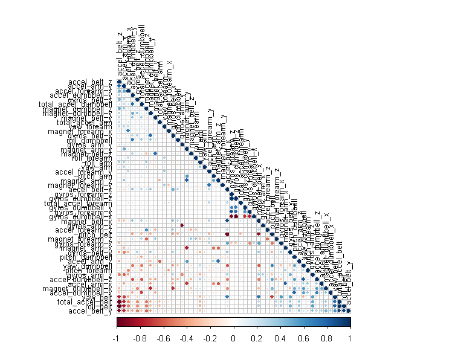

# Practical Machine Learning Course Project
zhoukelvin  
Monday, January 26, 2015  

# Executive Summary
Using devices such as Jawbone Up, Nike FuelBand, and Fitbit it is now possible to collect a large amount of data about personal activity relatively inexpensively. These type of devices are part of the quantified self movement - a group of enthusiasts who take measurements about themselves regularly to improve their health, to find patterns in their behavior, or because they are tech geeks. One thing that people regularly do is quantify how much of a particular activity they do, but they rarely quantify how well they do it. 

The aim of this report was to use data from accelerometers placed on the belt, forearm, arm, and dumbell of six participants to predict how well they were doing the exercise in terms of the classification in the data. 

### Libraries
The following libraries were used throughout the code.

```r
library(caret)
```

```
## Loading required package: lattice
## Loading required package: ggplot2
```

```r
library(corrplot)
library(kernlab)
library(knitr)
library(randomForest)
```

```
## randomForest 4.6-10
## Type rfNews() to see new features/changes/bug fixes.
```


### Loading and preprocessing the data
Two csv files contatining the training and test data was downloaded from Amazon's cloudfront on the 24/08/2014 into a data folder in the working directory. 


```r
# check if a data folder exists; if not then create one
if (!file.exists("data")) {dir.create("data")}

# file URL and destination file
fileUrl1 <- "https://d396qusza40orc.cloudfront.net/predmachlearn/pml-training.csv"
destfile1 <- "./data/pml-training.csv"
fileUrl2 <- "https://d396qusza40orc.cloudfront.net/predmachlearn/pml-testing.csv"
destfile2 <- "./data/pml-testing.csv"

# download the file and note the time
download.file(fileUrl1, destfile = destfile1)
download.file(fileUrl2, destfile = destfile2)
dateDownloaded <- date()
```

The training data was then loaded into R.


```r
# read the csv file for training 
data_training <- read.csv("./data/pml-training.csv", na.strings= c("NA",""," "))
```

There was a lot of NA values in the data which would create a lot of noise for the model. As a result, these columns were removed from the data set. The first eight columns that acted as identifiers for the experiment were also removed.


```r
# clean the data by removing columns with NAs etc
data_training_NAs <- apply(data_training, 2, function(x) {sum(is.na(x))})
data_training_clean <- data_training[,which(data_training_NAs == 0)]

# remove identifier columns such as name, timestamps etc
data_training_clean <- data_training_clean[8:length(data_training_clean)]
```

### Creating a model
The test data set was split up into training and cross validation sets in a 70:30 ratio in order to train the model and then test it against data it was not specifically fitted to.


```r
# split the cleaned testing data into training and cross validation
inTrain <- createDataPartition(y = data_training_clean$classe, p = 0.7, list = FALSE)
training <- data_training_clean[inTrain, ]
crossval <- data_training_clean[-inTrain, ]
```

A random forest model was selected to predict the classification because it has methods for balancing error in class population unbalanced data sets. The correlation between any two trees in the forest increases the forest error rate. Therefore, a correllation plot was produced in order to see how strong the variables relationships are with each other.


```r
# plot a correlation matrix
correlMatrix <- cor(training[, -length(training)])
corrplot(correlMatrix, order = "FPC", method = "circle", type = "lower", tl.cex = 0.8,  tl.col = rgb(0, 0, 0))
```

 

In this type of plot the dark red and blue colours indicate a highly negative and positive relationship respectively between the variables. There isn't much concern for highly correlated predictors which means that all of them can be included in the model.

Then a model was fitted with the outcome set to the training class and all the other variables used to predict.


```r
# fit a model to predict the classe using everything else as a predictor
model <- randomForest(classe ~ ., data = training)
model
```

```
## 
## Call:
##  randomForest(formula = classe ~ ., data = training) 
##                Type of random forest: classification
##                      Number of trees: 500
## No. of variables tried at each split: 7
## 
##         OOB estimate of  error rate: 0.47%
## Confusion matrix:
##      A    B    C    D    E class.error
## A 3902    3    0    0    1 0.001024066
## B   11 2643    4    0    0 0.005643341
## C    0   10 2382    4    0 0.005843072
## D    0    0   23 2227    2 0.011101243
## E    0    0    2    4 2519 0.002376238
```

The model produced a very small OOB error rate of .56%. This was deemed satisfactory enough to progress the testing.

### Cross-validation
The model was then used to classify the remaining 30% of data. The results were placed in a confusion matrix along with the actual classifications in order to determine the accuracy of the model.


```r
# crossvalidate the model using the remaining 30% of data
predictCrossVal <- predict(model, crossval)
confusionMatrix(crossval$classe, predictCrossVal)
```

```
## Confusion Matrix and Statistics
## 
##           Reference
## Prediction    A    B    C    D    E
##          A 1673    1    0    0    0
##          B    4 1135    0    0    0
##          C    0    2 1022    2    0
##          D    0    0    6  957    1
##          E    0    0    1    0 1081
## 
## Overall Statistics
##                                           
##                Accuracy : 0.9971          
##                  95% CI : (0.9954, 0.9983)
##     No Information Rate : 0.285           
##     P-Value [Acc > NIR] : < 2.2e-16       
##                                           
##                   Kappa : 0.9963          
##  Mcnemar's Test P-Value : NA              
## 
## Statistics by Class:
## 
##                      Class: A Class: B Class: C Class: D Class: E
## Sensitivity            0.9976   0.9974   0.9932   0.9979   0.9991
## Specificity            0.9998   0.9992   0.9992   0.9986   0.9998
## Pos Pred Value         0.9994   0.9965   0.9961   0.9927   0.9991
## Neg Pred Value         0.9991   0.9994   0.9986   0.9996   0.9998
## Prevalence             0.2850   0.1934   0.1749   0.1630   0.1839
## Detection Rate         0.2843   0.1929   0.1737   0.1626   0.1837
## Detection Prevalence   0.2845   0.1935   0.1743   0.1638   0.1839
## Balanced Accuracy      0.9987   0.9983   0.9962   0.9982   0.9994
```

This model yielded a 99.3% prediction accuracy. Again, this model proved very robust and adequete to predict new data.

### Predictions
A separate data set was then loaded into R and cleaned in the same manner as before. The model was then used to predict the classifications of the 20 results of this new data.


```r
# apply the same treatment to the final testing data
data_test <- read.csv("./data/pml-testing.csv", na.strings= c("NA",""," "))
data_test_NAs <- apply(data_test, 2, function(x) {sum(is.na(x))})
data_test_clean <- data_test[,which(data_test_NAs == 0)]
data_test_clean <- data_test_clean[8:length(data_test_clean)]

# predict the classes of the test set
predictTest <- predict(model, data_test_clean)
predictTest
```

```
##  1  2  3  4  5  6  7  8  9 10 11 12 13 14 15 16 17 18 19 20 
##  B  A  B  A  A  E  D  B  A  A  B  C  B  A  E  E  A  B  B  B 
## Levels: A B C D E
```

### Conclusions
With the abundance of information given from multiple measuring instruments it's possible to accurately predict how well a person is preforming an excercise using a relatively simple model. 

#Generating Answers Files to Submit for Assignment

The following function to create the files to answers the Prediction Assignment Submission:

```r
pml_write_files = function(x){
  n = length(x)
  for(i in 1:n){
    filename = paste0("./answers/problem_id_",i,".txt")
    write.table(x[i],file=filename,quote=FALSE,row.names=FALSE,col.names=FALSE)
  }
}

pml_write_files(predictTest)
```

